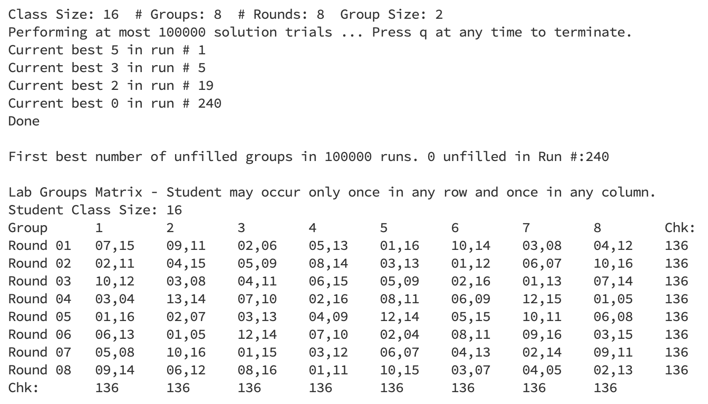
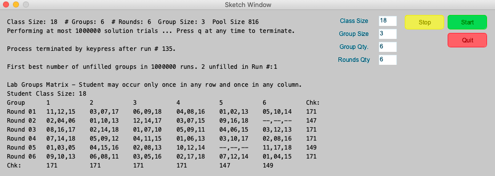

# Lab Group Assigning

* A tool for teachers to assign students to lab groups written in Processing's java code [Processing](processing.org) .
* This tool selects groups of student teams from a student class population to be involved in lab tasks during experiment rounds. Each student is involved once every session round and once for each different tasks. 
* Each lab group, i.e. a combination of students, like a student pair for example, is assigned no more than once. The number of possible lab groups, referred to as Pool Size, is the number of group sized student combinations chosen from the class size.
* The output results go to both the console and the Processing application screen.
* The inputs are:
  * Class Size - The number of students in the selection pool.
  * Group Qty - The number of tasks. These are the output matrix columns.
  * Round Qty - The number of session rounds. These are the output matrix rows.
  * Group Size - The student grouping size. The matrix cells are the assigned student groups. The students are selected from the class, i.e. the selection pool. The integer numbers identify the students. For example the student group, "03,06,12", is a group consisting of student 03, student 06 and student 12.
* The class Size should be equal to the Group Size x (larger of Group Qty and Round Qty). Student selection will not be a balanced participation when Group Qty and Round Qty are not equal. The same applies when the Class Size is larger than the required number. Chk value variation indicates unbalanced participation.

## Example Console Output - Complete Run

## Example Screen Output - Keypress Terminated Run

## Notes

* The Chk: values are checksum values that are the sum of the assigned student id numbers. Properly assigned row and columns will have the same checksum.
* Matrix values like --,--,-- indicate there was no valid lab group solution determined for the trial run.
* This program makes random lab group selections for each matrix value from an ever decreasing pool of remaining possible lab group candidates. It records the most filled assignment matrix. Selection attempts stop when the matrix is totally filled or after the number of solution trials is expired.
* Pressing the q key stops the process and outputs the current best solution.
