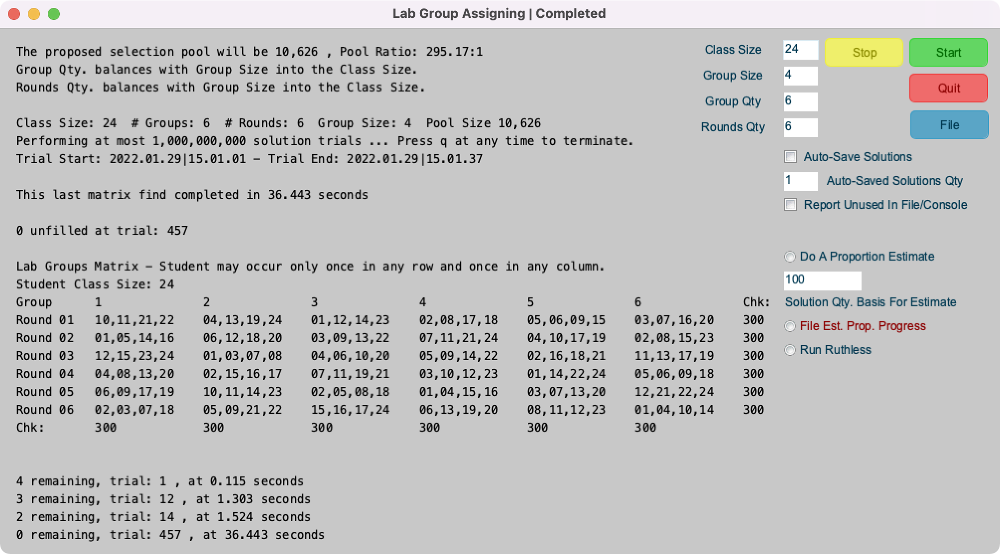

# Lab Group Assigning

* A tool for teachers to assign students to lab groups written in Processing's java code **[Processing](https://www.processing.org)**. It may be built for running on Apple OSX, Linux and Windows operating systems.
* This tool selects groups of student teams from a student class population to be involved in lab tasks during experiment rounds. Each student is involved once every session round and once for each different tasks.
* Each lab group, i.e. a combination of students as a team, like a student pair for example, is assigned no more than once. The number of possible lab groups, referred to as **Pool Size**, is the number of group sized student combinations chosen from the class size.
* The output results go to both the console and the Processing application screen.
* The inputs are:
  * **Class Size** - The number of students in the selection pool.
  * **Group Qty** - The number of tasks. These are the output matrix columns.
  * **Rounds Qty** - The number of session rounds. These are the output matrix rows.
  * **Group Size** - The student grouping size. The matrix cells are the assigned student groups. The students are selected from the class, i.e. the selection pool. The integer numbers identify the students. For example the student group, "03,06,12", is a group consisting of student 03, student 06 and student 12.
  * **Auto Save Solutions** - A checkbox for running a series of solutions for the same conditions where each solution result is automatically saved to a text file.
  * **Auto Saved Solutions** - The number of solutions that will be run with the same conditions where each solution result is saved to text file.
* The **Class Size** should be equal to the **Group Size** x (larger of **Group Qty** and **Rounds Qty**). Student selection will not be a balanced participation when **Group Qty** and **Rounds Qty** are not equal. The same applies when the **Class Size** is larger than the required number. **Chk** value variation indicates unbalanced participation.

## Example Screen - Solution Found

## Example Screen Output - Keypress Terminated Run

## Notes

* The application window is re-sizable.
* Execution time is pure luck for the lengthy tasks. For example the solution for the 8 x 8 x 2 shown above occurred under 5 minutes. This same task could take hours.
* The **Chk:** values are row and column checksum values that are the sum of the assigned student id numbers. Properly assigned row and columns will have the same checksum.
* This program continuously makes random lab group selections for each matrix value chosen from an ever decreasing pool of remaining possible lab group candidates. It records the most filled assignment matrix and tracks the least unfilled number score. New matrix build attempts start when the current matrix build develops an equal unfilled score. The displayed matrix is the last best assignment matrix build. Selection trials stop when the matrix is totally filled or after the number of solution trials is expired.
* Matrix values like --,--,-- indicate there was no valid lab group combination possible for that matrix position for the trial run.
* Terminating a long running solution attempt and then restarting it gains nothing. It would be pure random luck that a restarted solution attempt can quickly arrive at a solution. The matrix displayed while running a solution attempt is only the first best solution so far. It is not the basis for any subsequent possible solution. It represents a random matrix guess that failed because it was impossible to fill the unfilled cells. For every unfilled cell you can check and see for yourself that there could not be a remaining group that could satisfy the selection criteria.
* The time required to complete the assignment matrix is a function of the selection pool size. The selection pool size depends on the class size (**n**) and the group size (**k**) as **n!/k!\*(n-k)!** . The number of possible assignment matrices of size **gr** (group qty x rounds qty) that can be selected from the pool size **p** is **p!/gr!\*(p-gr)!** . That number can be enormous.
* The number of valid solution matrices within the pool of possible assignment matrices is not known to this author but the number appears to be large enough to quickly find a valid solution at random from a pool of 3 billion possible for a 5x5 matrix using a 2 group size.
* Pressing the **q** key stops the process and outputs the current best solution. The **Stop** button does the same but it may not be as responsive as the **q** key press.

## File Button

* The **File** button creates a text file of the current results _**within the folder that contains the application**_. The files saved are named "LGM_\<**Class Size**>\_\<**Group Size**>\_<**Group Qty**>x\<**Rounds Qty**>" with a time code indicating the time the file is created. For example the file named **LGM_10_2_5x5_2021-6-1_15447_269223+88.txt** was made at 15:44:07 and some milliseconds + a random number on June 1, 2021. The millisecond + random number provides for unique filenames when files happen to be made very quickly using the **Auto Save Solutions** option when thew solution conditions solve very quickly.
* Use the **Auto Save Solutions** checkbox and the **Auto Saved Solutions** quantity entry field to automatically save results.
* When the **Report Unused in File** option is checked the **File** output reports the student group combinations that were not selected for the lab groups matrix. On Linux systems, where one runs the application from a **Terminal** window, this information outputs to the **Terminal** window whenever a trials session completes or one stops a running process.
* The **File** button is enabled and functional at all times. When pressed during a process the resulting file is a snapshot of the current state.
  

## Install and Running

* A Prebuilt application file for Apple OSX is provided as a zip file in this repository at [/Releases/macosx](Releases/macosx/). It is also available in the releases section.
* Prebuilt application files for Linux and Windows are not provided in this repository at this time. That may be in the future. They are easily built from the **Processing IDE** with the files in this repository. **LabGroupsAssigning** can be executed from within the **Processing IDE**. Those familiar with **Processing** would need no instructions other than the knowledge that the **G4P** GUI controls library needs to be installed. Those not familiar with **Processing** need to start here: **[Processing](https://www.processing.org)**.
* A **Processing** application is a Java application. Therefore the Java run-time system is required to be installed or packaged within the application. As of this writing the option to package Java within the application is possible only with Apple OSX systems.
* **Window Un-Minimizing (Unhide) on Apple OSX:** Select the running application's icon in the **Dock** to restore the minimized window. The exported **Processing** application for Apple OSX has a simple top menu that lacks **Window** controls used to restore a miminized window one might happen to minimize via the application's **Yellow** control dot. **Command Tab** switching to the application will not resize the minimized application window. This is normal behavior for OSX applications, but OSX applications have the top menu **Window** control where the OS places a restore option for all minimized child windows. As of this writing exported Processing 3 applications lack that control. 
